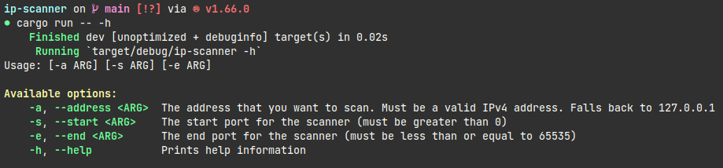

= Simple IP-Scanner

This program is a command-line utility that allows you to scan a network for open ports. It is written in Rust and uses the tokio library (https://github.com/tokio-rs/tokio) to perform asynchronous IO operations.

== Installation

To build and run this program, you will need to have the Rust programming language and its package manager, Cargo, installed on your system. You can find instructions for installing Rust at https://www.rust-lang.org/tools/install[here].

To build and run the program, clone this repository and run the following commands:

 $ cargo build
 $ cargo run -- <arguments>

== Usage

To see how to use the program, run the following command:

 $ cargo run -- -h

This will show to the valid arguments:

The program will scan the specified range of ports and print out any open ports it finds.

== Example

    $ cargo run -a 192.168.1.100 -s 1 -e 100

This will scan the range of ports from 1 to 100 on the device with the IP address 192.168.1.100, and print out any open ports it finds. The scanning process might take few minutes.

== Important note
It is important to note that using an IP scanner to scan devices on a network without permission may be illegal in some jurisdictions. It is the user's responsibility to ensure that they are acting in compliance with all relevant laws and regulations. Using an IP scanner for malicious purposes, such as unauthorized access or network attacks, is strictly prohibited and may result in criminal penalties. By using this program, you agree to use it only for legitimate purposes and to indemnify the developers against any damages or legal action resulting from your use of the program. Please use this tool responsibly and respect the privacy and security of others.
